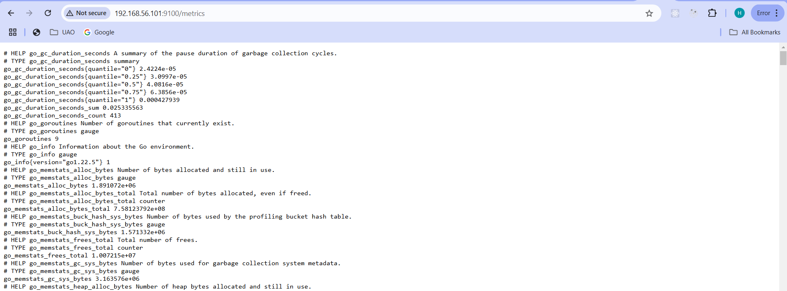

# Guía para Desplegar un Sitio Web Estático, Configuración y Monitoreo con Prometheus y Grafana

Esta guía describe cómo cargar un sitio web estático en un servidor Nginx, configurar Prometheus para recopilar métricas de la máquina virtual y luego usar Grafana para visualizar estas métricas.

En el siguiente link se encuentra el [Video Demo](https://)

## Paso 1: Cargar Archivos Necesarios para Desplegar un Sitio Web Estático

El objetivo de este paso es cargar los archivos necesarios (al menos un archivo HTML y una imagen) en el servidor Nginx en **VM1** para desplegar un sitio web estático.

### 1.1. Acceso a la Máquina Virtual

Primero, debes acceder a tu máquina virtual (VM1) en la que se encuentra instalado el servidor Nginx. Utiliza SSH para conectarte:

```bash
vagrant ssh vm1
```

### 1.2. Crear un Directorio para el Sitio Web Estático

Una vez que estés dentro de la VM, navega al directorio donde Nginx busca los archivos web. El directorio predeterminado suele ser `/var/www/html`:

```bash
cd /var/www/html
```


Si no existe, crea un nuevo directorio donde almacenarás tu sitio web estático:

```bash
sudo mkdir mi_sitio_estatico
cd mi_sitio_estatico
```


### 1.3. Subir los Archivos HTML e imagenes

#### Uso de Directorios Sincronizados con **Vagrant**

Como estamos utilizando **Vagrant** para la gestión de nuestra VM, podemos configurar un directorio sincronizado para cargar los archivos locales automáticamente a la máquina virtual.

1. Abre el archivo `Vagrantfile` en tu proyecto y agrega la siguiente configuración para sincronizar el directorio local con la VM:
   ```ruby
   vm1.vm.synced_folder "ruta/local/a/tus/archivos", "/var/www/html/mi_sitio_estatico"
   ```

2. Luego, recarga la configuración de Vagrant para que los cambios tengan efecto:
   ```bash
   vagrant reload
   ```

Los archivos de tu directorio local se copiarán automáticamente al directorio de la máquina virtual. En nuestro caso estamos usando el template de una pagina web completa, la puedes encontrar en este repositorio en la carpeta `ninestars_static_web`.


### 1.4. Verificar la Estructura de Archivos

Una vez que hayas subido los archivos, verifica que estén en el directorio correcto:

```bash
ls /var/www/html/mi_sitio_estatico
```


## Paso 2: Acceder al Sitio Web Estático desde el Navegador

Ahora que los archivos han sido cargados correctamente, debes verificar que el sitio web se despliegue correctamente desde el navegador.

1. Abre tu navegador en tu computador host y accede a la IP del servidor Nginx, seguido del nombre de tu directorio, por ejemplo:

   ```bash
   http://192.168.56.101/mi_sitio_estatico
   ```

2. Si todo está configurado correctamente, se deberia cargar la pagina web estatica.

  
  

## Paso 3: Verificar que Prometheus Está Recopilando Métricas del Servidor

En este paso, instalaremos el **node_exporter** y configuraremos **Prometheus** para recopilar métricas importantes de la máquina virtual, como peticiones recibidas, consumo de memoria y consumo de disco.


### 3.1. Instalar Node Exporter en las maquinas virtuales

Vamos a instalar `node_exporter` por medio del provisionamiento con Ansible, para esto debemos crear un playbook `install_node_exporter.yml` con el script para descargar y configuar `node_exporter` en todos nuestros nodos:

```init
---
- name: Instalar Node Exporter en todas las VMs
  hosts: all
  become: yes

  tasks:
    - name: Descargar Node Exporter
      get_url:
        url: "https://github.com/prometheus/node_exporter/releases/download/v1.8.2/node_exporter-1.8.2.linux-amd64.tar.gz"
        dest: "/tmp/node_exporter.tar.gz"

    - name: Extraer Node Exporter
      unarchive:
        src: "/tmp/node_exporter.tar.gz"
        dest: "/usr/local/bin/"
        remote_src: yes

    - name: Mover binario de Node Exporter
      command: mv /usr/local/bin/node_exporter-1.8.2.linux-amd64/node_exporter /usr/local/bin/node_exporter

    - name: Crear usuario para Node Exporter
      user:
        name: node_exporter
        system: yes
        shell: /sbin/nologin

    - name: Crear archivo de servicio para Node Exporter
      copy:
        dest: /etc/systemd/system/node_exporter.service
        content: |
          [Unit]
          Description=Node Exporter
          After=network.target

          [Service]
          User=node_exporter
          ExecStart=/usr/local/bin/node_exporter
          Restart=always

          [Install]
          WantedBy=default.target

    - name: Recargar systemd
      command: systemctl daemon-reload

    - name: Habilitar y iniciar Node Exporter
      systemd:
        name: node_exporter
        enabled: yes
        state: started
```

Con este script estamos descargango y extrayendo el contenido del binario, para luego moverlo a `/usr/local/bin/`. Despues creamos el servicio node_exporter, lo configuramos y finalmente lo reiniciamos.

Ahora solo nos falta modificar nuestro `vagrantfile` para agregar la siguiente configuracion para el provisionamiento con Ansible:

```init
  # Provisionar con Ansible para todas las VMs
  config.vm.provision "ansible" do |ansible|
    ansible.playbook = "playbook.yml"
  end
```

Por ultimo, ejecutamos `vagrant reload` para reiniciar nuestras maquinas virtuales.

### 3.3. Verificar la Instalación

Ejecuta los siguiente comandos para verificar que el node_exporter se instalo correctamente:

```bash
sudo systemctl status node_exporter
```


Accede desde el navegador al puerto por defecto (9100):

```arduino
http://192.168.56.101:9100/metrics
```


### 3.4. Configuración de Prometheus 

Verifica que Prometheus esté correctamente configurado para recopilar estas métricas. Asegúrate de que en el archivo de configuración de Prometheus (`/etc/prometheus/prometheus.yml`) se incluyan los targets para Nginx y el `node_exporter` en la **VM2**:

```yaml
scrape_configs:
  - job_name: 'nginx'
    static_configs:
      - targets: ['192.168.56.101:9100']  # Exportador de métricas de Nginx

  - job_name: 'node_exporter'
    static_configs:
      - targets: ['localhost:9100']  # Exportador de métricas del sistema
```


Despues de hacer los cambios en la configuración de Prometheus, reinicia el servicio para que los cambios surtan efecto:

```bash
sudo systemctl restart prometheus
```


### 3.5. Verificar el Funcionamiento de Prometheus

1. Abre el navegador y accede a la interfaz web de Prometheus. Usualmente, Prometheus corre en el puerto `9090` por defecto:

   ```bash
   http://192.168.56.102:9090
   ```
   
   
3. Dentro de la interfaz de Prometheus, buscamos las métricas que deseamos verificar:

   - **Peticiones recibidas**: 
     ```prometheus
     http_requests_total
     ```
     

   - **Consumo de memoria**:
     ```prometheus
     node_memory_MemAvailable
     ```
     

   - **Consumo de disco**:
     ```prometheus
     node_filesystem_free
     ```
     

En la interfaz de Prometheus, asegúrate de que las métricas de peticiones, memoria y disco estén apareciendo correctamente. Puedes hacer esto al ingresar las consultas mencionadas anteriormente en el campo de búsqueda de la interfaz.

## Paso 4: Configurar Grafana para Crear un Dashboard con las Métricas de Prometheus

Grafana es una herramienta poderosa para visualizar las métricas recopiladas por Prometheus. A continuación, se muestra cómo configurar Grafana y crear un dashboard con las métricas que hemos configurado en Prometheus.

### 4.1. Acceder a la Interfaz de Grafana

1. En el navegador, acceder a la interfaz de Grafana en el puerto `3000` por defecto:

   ```bash
   http://192.168.65.102:3000
   ```

2. Inicia sesión en Grafana utilizando las credenciales predeterminadas (usuario: `admin`, contraseña: `admin`), o las credenciales que hayas configurado previamente.

### 4.2. Configurar la Fuente de Datos de Prometheus

1. Ve a **Connections** en el menú lateral y selecciona **Data Sources**.

2. Selecciona **Prometheus** como tipo de fuente de datos.

3. Configura la URL de Prometheus como `http://localhost:9090` y guarda los cambios.

### 4.3. Crear un Dashboard en Grafana

1. En el menú lateral, selecciona **Dashboard** y luego **New**.

2. Añade un panel para visualizar las métricas. Usamos las siguientes consultas para cada panel:

   - **Peticiones Recibidas**:
     ```prometheus
     nginx_http_requests_total
     ```

   - **Consumo de Memoria**:
     ```prometheus
     node_memory_MemTotal_bytes - node_memory_MemFree_bytes
     ```

   - **Consumo de Disco**:
     ```prometheus
     node_filesystem_size_bytes - node_filesystem_avail_bytes
     ```

4. Por ultimo, guardamos el dashboard y le ponemos un nombre.


---
#### Integrantes
- Andres Mauricio Ariza: 2217297
- Eduardo Stevens Marino: 2217227
- Harlem Maaria Cortes: 2220814
